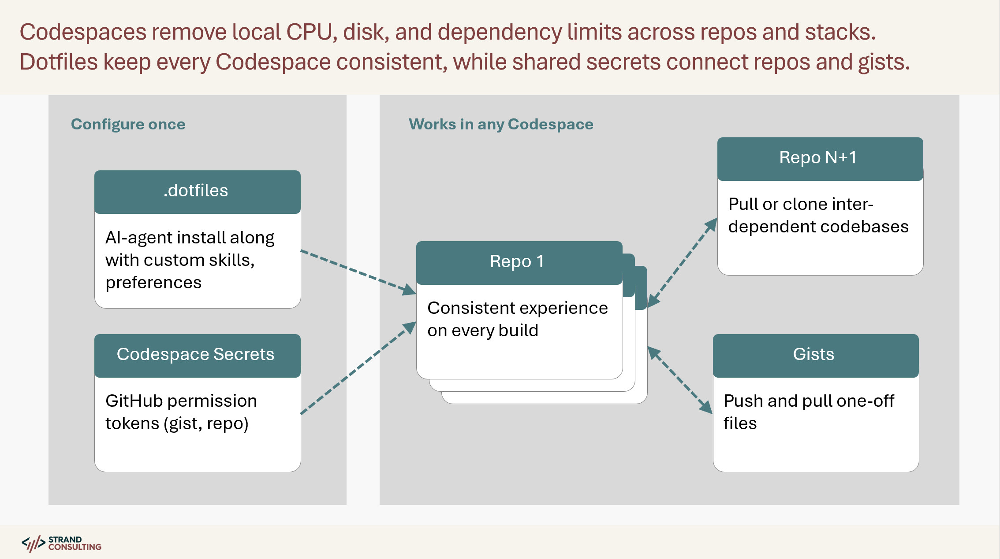

# A Consistent, Connected Environment for AI-Assisted Development

## Dotfiles

GitHub clones your dotfiles repo into every Codespace automatically and runs `install.sh` on creation. See [GitHub's dotfiles documentation](https://docs.github.com/en/codespaces/setting-your-user-preferences/personalizing-github-codespaces-for-your-account#dotfiles).

Your dotfiles can contain:

- **Installation scripts** (`install.sh`, `scripts/`) - Set up Claude Code and dependencies
- **Custom skill definitions** (`commands/*.md`) - Extend Claude's capabilities
- **Configuration templates** - Default settings and preferences

This works across any repository without modifying the project itself. Your AI setup stays in your dotfiles, not scattered across repos.

## Codespace Secrets

Stored in your GitHub account settings and available as environment variables in every Codespace.

Useful for:

- **API keys** - Service credentials your scripts need
- **Tokens** - GitHub tokens for CLI operations, other integrations
- **Configuration values** - Anything you don't want in your dotfiles repo

## Custom Skills: Extending Claude

Skills are markdown files in `commands/` that become `/skill-name` commands in Claude Code. The build script (`scripts/build-commands.sh`) compiles all skill definitions into `~/.claude/commands.json` during installation.

Current skills in this repo:

- `/browser` - Browser automation with Puppeteer
- `/commit` - Atomic commit workflow
- `/doc-style` - Documentation preferences
- `/save-context` - Session handoff documents
- `/save-plan` - Plan/design storage
- `/secrets` - GitHub token configuration